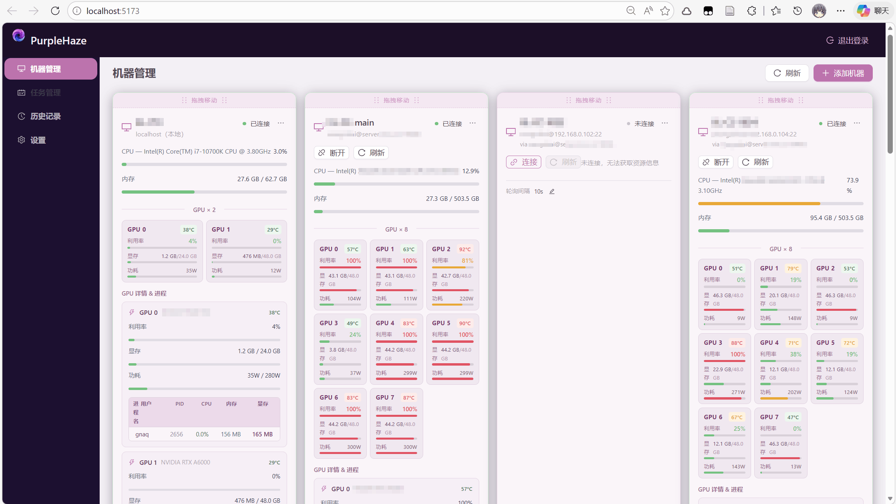
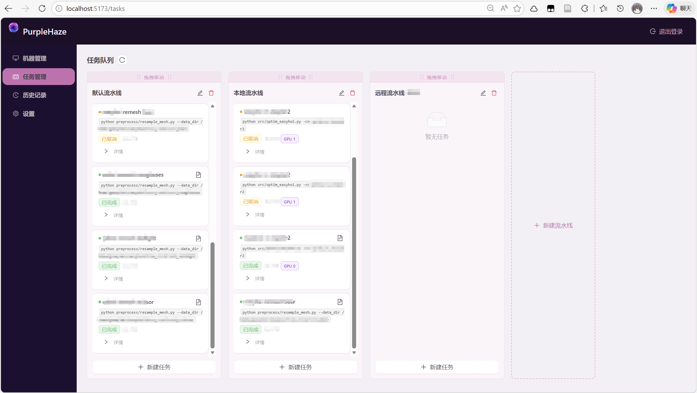
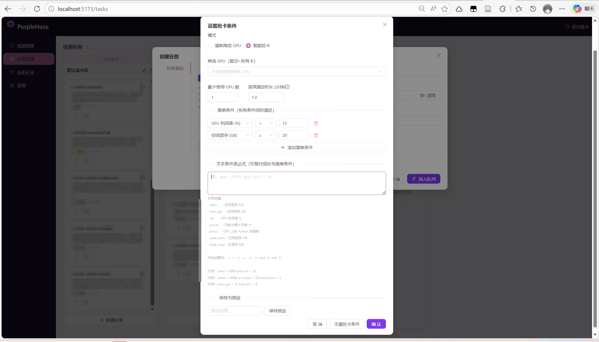
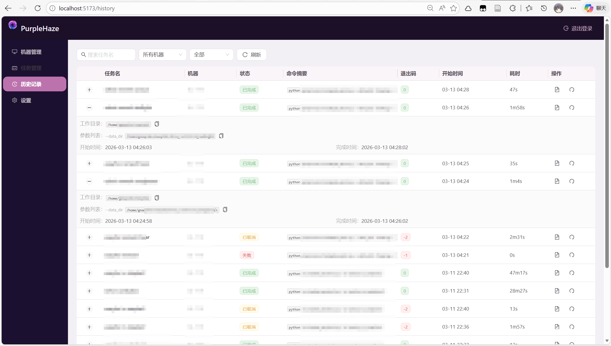

# PurpleHaze

<p align="center">
    
</p>

> Web-based task scheduling and machine resource management tool, designed for Deep Learning and bare-metal GPU server nodes. 
> 基于 Web 的任务调度与计算资源管理工具，专为深度学习和 GPU 裸机集群设计。

---

## IMPORTANT

**此项目是一个 Vibe coding 项目。由 [GNAQ](https://github.com/GNAQ) 与他的 Coding Agents 构想、构建、审阅与维护。**

本项目受 [FlowLine](https://github.com/Dramwig/FlowLine) 的启发建设而成。This project was largely inspired by [FlowLine](https://github.com/Dramwig/FlowLine).

PurpleHaze 想要做得比 FlowLine 更好！

> Fun fact: GNAQ 本人其实基本不怎么会写 TypeScript 和 React。如果你觉得前端写得不错，那就给他的 Coding Agents 点个赞吧！👍

### 🚨 风险声明

本项目有着为显卡资源紧张环境（如实验室）中的用户提供**自动化检测与占用空闲 GPU 的能力**，便于快速启动任务、避免人工轮询等待。

使用本脚本可能带来的风险包括但不限于：

* 与他人并发调度产生冲突，影响公平使用；
* 若滥用，可能违反实验室/平台管理规定；

开发者对因使用本脚本而导致的**资源冲突、账号受限、数据丢失或任何直接间接损失**概不负责。

### 📌 使用前须知

* 本项目提供的工具**不会以暴力方式强制杀掉他人任务**，也**不会绕过权限限制或系统调度机制**。
* 本项目默认**只在用户拥有访问权限的设备上运行**，请确保遵守所在实验室或计算平台的使用规则。
* **请勿用于占用公共资源或干扰他人科研工作**，违者后果自负。
* 本项目使用单用户设计理念，虽然支持多用户使用，但理论上它的单一部署只适合为您一人服务。

## 核心功能

- 统一本地 + 远端 SSH 机器看板，便捷监控多台机器的资源使用情况。
- 多流水线 + 任务单元的任务管理器，多任务顺序、多任务异步均支持，智能规划所有任务。
- 智能抢卡机制，根据可简单可复杂的抢卡条件，合理分配任务到不同机器，最大化资源利用率。
- 方便的任务创建、任务模板机制，轻松批量调参跑实验，粘贴命令智能填写任务表格。
- 历史任务持久化管理，保存丰富的任务元数据和任务输出。

## Screenshots









---

## 功能状态

| 模块 | 状态 |
|------|------|
| 0. 基础功能（认证、设置、启动） | ✅ 已实现 |
| 1. 本地/远程机器管理与资源监控 | ✅ 已实现 - 🔂 迭代中 |
| 2. 任务管理与资源调度 | ✅ 已实现 - 🔂 迭代中 |
| 3. 历史任务记录与分析 | ✅ 已实现 - 🔂 迭代中 |

---

## 技术栈

**后端（Xxium）：**
- Python 3.11+, FastAPI, SQLAlchemy 2.0, SQLite (aiosqlite)
- Paramiko（SSH 连接）, psutil + pynvml（资源监控）
- passlib[bcrypt]（密码哈希）, python-jose（JWT）

**前端（PurpleHaze/PPH）：**
- React 18, TypeScript, Vite
- Ant Design 5, Zustand, Axios

---

## 快速启动

### 0. 环境准备（必做）

先安装依赖（会自动创建 `backend/.venv` 并安装前后端依赖）：

```bash
./setup.sh
```

可选：

```bash
./setup.sh --backend   # 仅安装/更新后端依赖
./setup.sh --frontend  # 仅安装/更新前端依赖
```

### 开发模式

前后端分别运行，支持热重载：

```bash
./start.sh
```

- 前端：http://localhost:5173
- 后端 API：http://localhost:34357

也支持仅启动一侧：

```bash
./start.sh --backend   # 仅后端
./start.sh --frontend  # 仅前端
```

开发模式日志会在每次启动时重置：

- `logs/backend.dev.log`
- `logs/frontend.dev.log`

### 生产模式

构建前端后，通过后端统一提供服务：

```bash
./start.sh --prod
```

- 服务：http://localhost:34357（同时提供 API 和前端静态文件）
- 生产模式不支持仅前端启动
- 生产日志写入：`logs/backend.prod.YYYYMMDD-HHMMSS.log`

### 停止

```bash
./start.sh --stop
```

脚本会优先通过 `.pph.pid` 停止已记录进程；若 PID 文件不存在，会回退按端口清理。

### 以 systemd 服务运行

1. 将项目部署到 `/opt/purplehaze/`
2. 构建前端：`cd frontend && npm install && npm run build`
3. 安装 Python 依赖：`cd backend && python3 -m venv .venv && .venv/bin/pip install -r requirements.txt`
4. 安装 systemd 服务：

```bash
sudo cp purplehaze@.service /etc/systemd/system/
sudo systemctl daemon-reload
sudo systemctl enable purplehaze@$USER
sudo systemctl start purplehaze@$USER
```

---

## API 文档

启动后访问：http://localhost:34357/docs

---

## 环境变量

| 变量 | 默认值 | 说明 |
|------|--------|------|
| `PPH_DATA_DIR` | `backend/data` | 数据存储目录 |
| `PPH_SECRET_KEY` | 内置默认值 | JWT 签名密钥（生产环境请修改！） |
| `PPH_BACKEND_HOST` | `0.0.0.0` | 后端监听地址 |
| `PPH_BACKEND_PORT` | `34357` | 后端端口 |
| `PPH_FRONTEND_PORT` | `34356` | 前端端口 |

> 注意：`start.sh` 当前使用脚本内固定端口（开发前端 `5173`、后端 `34357`），不会读取以上端口环境变量。
> 上述变量主要在直接运行后端（例如 `python backend/main.py`）时生效。
